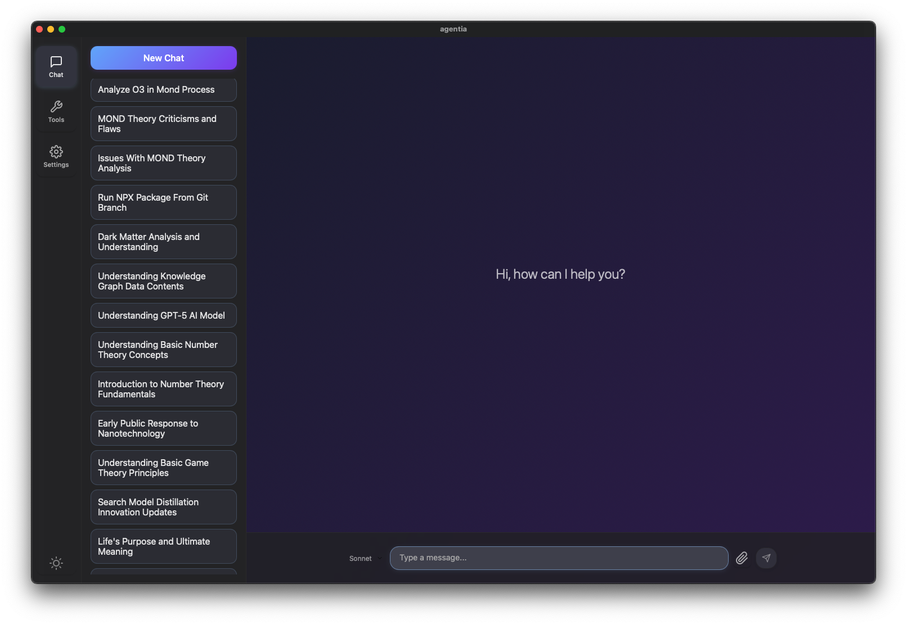
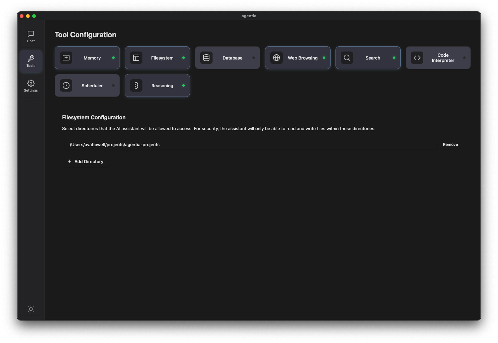
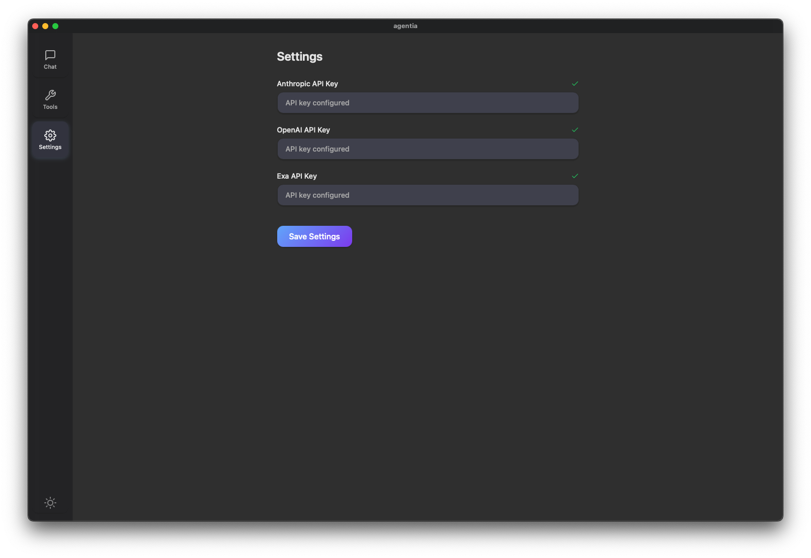

# agentia

This is a chat interface for LLMs, currently using Anthropic and OpenAI. Focused on experimenting with tool use/agentic behavior. Currently an early work in progress, mostly focused on experimentation and testing.

Built using Tauri, React, and Typescript. Implements a Tauri<>TS bridge for model context protocol.

`deno tauri task dev` to run.

